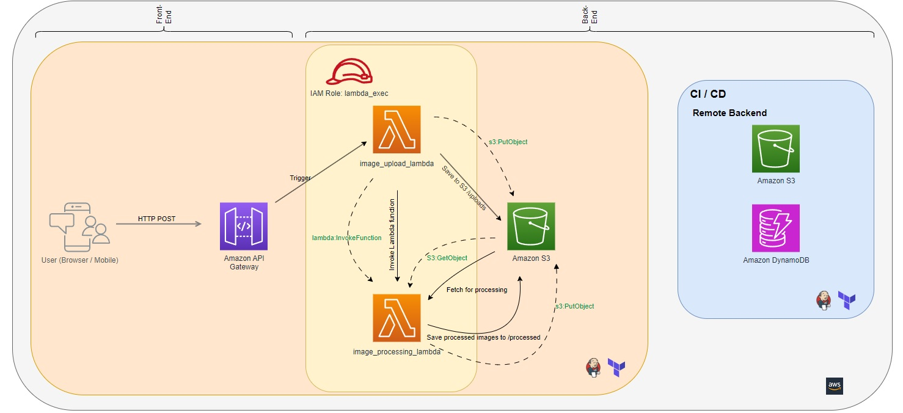

# Image Processing Platform

## Version
- 1.1 (planned) - link sharing including short links displayed on main web page
- 1.0 - storing and converting images to different resolution works and files are available to download directly from S3

## Introduction
This platform provides a streamlined solution for processing images. 
Users can upload images using a simple web page to S3 bucket using 1st Lambda function 
where 2nd Lambda function will generate multiple versions of the image with varying resolutions. 
All processed images are stored in an S3 bucket and are available for download.

## Design



## Features
- User-friendly web interface for image uploads.
- Automated image processing upon upload.
- Generation of images in three resolutions: thumbnail, medium, and large.
- Secure storage of images in AWS S3.
- Direct download links for processed images - will come with v1.1!

## Initial Setup
1. You need K8 with Jenkins that has TF installed - https://github.com/kozraf/Jenkins_with_TF for example
2. Secure your TF remote back end - https://github.com/kozraf/TFstate_secure for example
3. Use jenkins-pipeline.txt to deploy the app

## Structure
```
.
├── api_gateway.tf
├── iam_roles.tf
├── index.html
├── jenkins-pipeline.txt
├── main.tf
├── outputs.tf
├── s3-image-processing.tf
├── terraform.tfvars
├── variables.tf
└── modules
    └── lambdas
        ├── payloads
            ├── image_upload_lambda.zip
            ├── image_processing_lambda.zip                
        ├── lambdas_main.tf
        ├── lambdas_outputs.tf
        ├── lambdas_variables.tf
        ├── image_processing_lambda.py
        └── index.js
```

## Contributing
This is an open-source platform, and contributions are welcome. If you find any issues or have feature requests, please open an issue in the repository. For major changes, please open an issue first to discuss what you would like to change.
